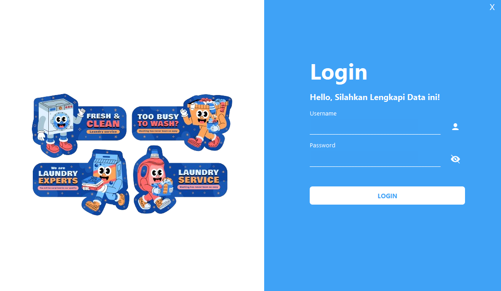
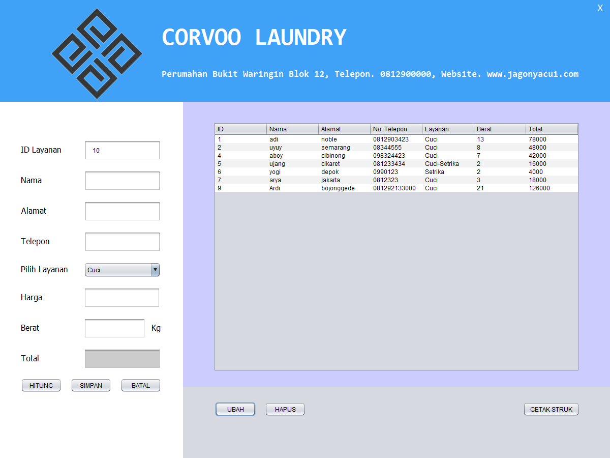
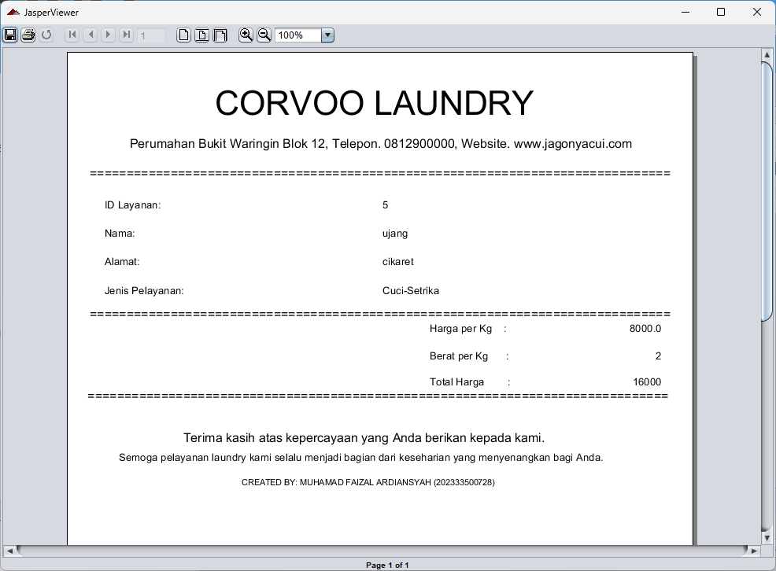

# 🧺 Corvoo Laundry

> Aplikasi desktop manajemen laundry berbasis Java GUI — dibangun untuk mempermudah operasional bisnis laundry mulai dari login, transaksi, hingga cetak laporan.

[](https://www.java.com)
[](https://netbeans.apache.org/)
[](https://www.mysql.com/)
[]()

---

## 📌 Tentang Project

**Corvoo Laundry** adalah aplikasi desktop CRUD untuk mengelola bisnis laundry — dibangun dengan Java Swing (NetBeans) dan database MySQL. Aplikasi ini dirancang dengan tampilan modern menggunakan **FlatLaf** look and feel, lengkap dengan sistem login, manajemen data, dan fitur cetak laporan otomatis via **JasperReport**.

## ✨ Fitur Utama

- **Login System** — autentikasi pengguna dengan toggle show/hide password
- **Tambah & Simpan Data Layanan** — input nama, alamat, telepon, dan jenis layanan pelanggan
- **Ubah & Hapus Data** — kelola data layanan yang sudah tersimpan dengan mudah
- **Hitung Otomatis** — kalkulasi total harga berdasarkan jenis layanan (Cuci/Setrika/Cuci-Setrika) dan berat (Kg)
- **Koneksi Database MySQL** — penyimpanan data terstruktur & terpusat
- **Cetak Struk Otomatis** — generate struk transaksi dengan JasperReport, lengkap dengan rincian harga
- **Tampilan Modern** — UI custom (rounded button, ikon interaktif) dengan FlatLaf theme

## 📸 Preview Aplikasi

<table>
  <tr>
    <td align="center"><b>🔐 Halaman Login</b></td>
  </tr>
  <tr>
    <td></td>
  </tr>
  <tr>
    <td>Tampilan awal aplikasi dengan ilustrasi tema laundry. User memasukkan <i>username</i> dan <i>password</i> untuk masuk ke sistem, dilengkapi tombol <i>show/hide password</i> 👁️.</td>
  </tr>
</table>

<table>
  <tr>
    <td align="center"><b>📋 Menu Utama — Manajemen Layanan</b></td>
  </tr>
  <tr>
    <td></td>
  </tr>
  <tr>
    <td>Halaman inti aplikasi untuk mengelola data layanan laundry — input nama, alamat, telepon, jenis layanan (Cuci/Setrika/Cuci-Setrika), berat, hingga hitung total otomatis. Dilengkapi tabel data, serta tombol <b>Ubah</b>, <b>Hapus</b>, dan <b>Cetak Struk</b>.</td>
  </tr>
</table>

<table>
  <tr>
    <td align="center"><b>🧾 Cetak Struk (JasperReport)</b></td>
  </tr>
  <tr>
    <td></td>
  </tr>
  <tr>
    <td>Struk transaksi otomatis berisi detail layanan, harga per kg, berat, dan total harga — dibuat menggunakan JasperReport, siap untuk dicetak atau disimpan sebagai bukti transaksi pelanggan.</td>
  </tr>
</table>

## 🛠️ Tech Stack

| Teknologi | Fungsi |
|---|---|
| Java (Swing) | Bahasa & GUI framework utama |
| NetBeans IDE | Tools development |
| MySQL | Database |
| JasperReport / iReport | Generate & cetak laporan |
| FlatLaf | Modern look and feel untuk UI |

## 📂 Struktur Project

```
Corvoo Laundry/
├── build/                  # Hasil compile (auto-generated)
├── database/
│   └── laundrycorvoo.sql   # Script database
├── lib/                    # Library eksternal (FlatLaf, JasperReport, MySQL Connector)
├── nbproject/               # Konfigurasi NetBeans
├── src/
│   └── AplikasiLaundry/
│       ├── icon/            # Icon & asset gambar
│       ├── koneksi.java      # Koneksi ke database
│       ├── login.java / login.form
│       ├── menu.java / menu.form
│       ├── cetakLayanan.jrxml / .jasper
│       └── buttonCustomRound.java
├── build.xml
├── manifest.mf
└── README.md
```

## 🚀 Cara Menjalankan

### 1. Persiapan Database
- Buka **phpMyAdmin** atau MySQL client favorit kamu
- Import file `database/laundrycorvoo.sql`
- Sesuaikan koneksi (host, username, password) di `koneksi.java`

### 2. Buka Project
```bash
# Clone repo
git clone https://github.com/username/Corvoo-Laundry.git
```
- Buka folder project menggunakan **NetBeans IDE**
- Pastikan semua library di folder `lib/` sudah ter-include (Clean and Build project)

### 3. Jalankan Aplikasi
- Klik **Run Project** (▶) di NetBeans, atau tekan `F6`
- Login menggunakan akun yang sudah didaftarkan di database

## 🗃️ Database

Struktur database tersedia di `database/laundrycorvoo.sql`, sudah termasuk tabel-tabel yang dibutuhkan aplikasi. Tinggal import langsung ke MySQL.

## 🌱 Status Pengembangan

Project ini masih berkembang — beberapa fitur tambahan (laporan keuangan, manajemen pelanggan, notifikasi status laundry) direncanakan untuk update selanjutnya.

## 🤝 Kontribusi

Saran, masukan, dan kontribusi sangat terbuka! Silakan buka **Issue** atau **Pull Request** kalau ada ide pengembangan. 😄

---

<p align="center">Made with ☕ & 🧺 — Corvoo Laundry</p>